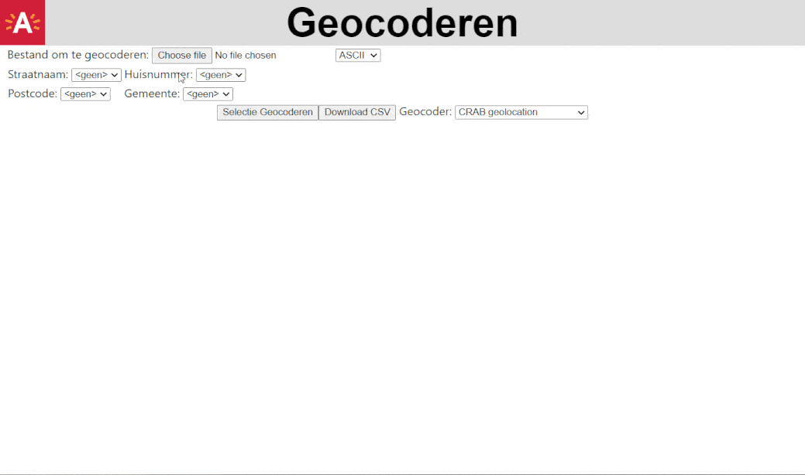

# Vlaamse Geocodeer tool

This allow you to geocode a csv-file with FLemish adresses using different geocoders including:
- OSM Nominatim <https://nominatim.org/>
- Vlaamse adressenregister: <https://www.vlaanderen.be/digitaal-vlaanderen/onze-oplossingen/gebouwen-en-adressenregister#informatie-voor-gebruikers>
- CRAB Geolocation: <https://overheid.vlaanderen.be/crab-geolocation>
- The Antwerp Location Picker Service: https://locationpicker-app1-p.antwerpen.be/ 
- Or you can pinpoint the address manually on a OSM-map.

## Installation

The compile this tool you need nodejs and yarn. 

You can install nodejs from <https://nodejs.org>

Then from the commandline run the following to install yarn:\
`npm install --global yarn`

Then check out the github-repo and use yarn to install all the dependencies. 
```
git clone https://github.com/Team-Data-Antwerpen/vl_geocoder
cd vl_geocoder
yarn install 
```

## Available Scripts

In the project directory, you can run:

### `npm start`

Runs the app in the development mode on parcel devellopement-server.\
Open [http://localhost:1234](http://localhost:1234) to view it in your browser.

The page will reload when you make changes.\
You may also see any lint errors in the console.

### `npm run build`

Builds the app for production to the `docs` folder.\
It correctly bundles React in production mode and optimizes the build for the best performance.

The build is minified and the filenames include the hashes.\
Your app is ready to be deployed!

## Deployment

To deploy to github pages, just make a build and commit it to the github-repo:

```
npm run build
git commit -a -m "New build"
git push 
```

The result will be available on <https://team-data-antwerpen.github.io/vl_geocoder/> afher a few minutes. 

## Demo


